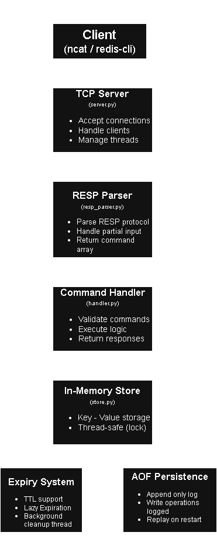

# py-redis-from-scratch

A Redis-like in-memory data store built from scratch using Python and raw TCP sockets. This project focuses on understanding backend systems, networking, concurrency, and data storage internals without using external frameworks.

---

## Overview

This project implements a simplified Redis server that communicates over TCP using the Redis Serialization Protocol (RESP). It supports basic key-value operations, expiration mechanisms, concurrency handling, and persistence through an append-only log.

---

## Features

- Custom TCP server using Python sockets
- RESP (Redis Serialization Protocol) parsing
- In-memory key-value store
- SET and GET command support
- TTL (Time-To-Live) with expiration
- Lazy expiration (on access)
- Active expiration (background cleanup thread)
- Thread-safe operations using locks
- Append-Only File (AOF) persistence
- Protocol validation and error handling

---

## Supported Commands

### SET
SET key value
SET key value EX seconds


### GET


GET key


### PING


PING


---

### Architecture


---

## Project Structure

```
src/
├── server.py        # TCP server and client handling
├── handler.py       # Command execution logic
├── resp_parser.py   # RESP protocol parser
├── store.py         # In-memory store, TTL, persistence
├── constants.py     # Configuration
```

---

## How to Run

1. Clone the repository:

```bash
git clone https://github.com/karthik-k11/py-redis-from-scratch.git
```
```bash
cd py-redis-from-scratch
```
2. Start the server:

```bash
cd src
```
```bash
python server.py
```

---

## Testing

Use `ncat` to connect to the server:

```bash
ncat 127.0.0.1 6379
```

Example:

```
*3
$3
SET
$3
key
$5
hello
```
